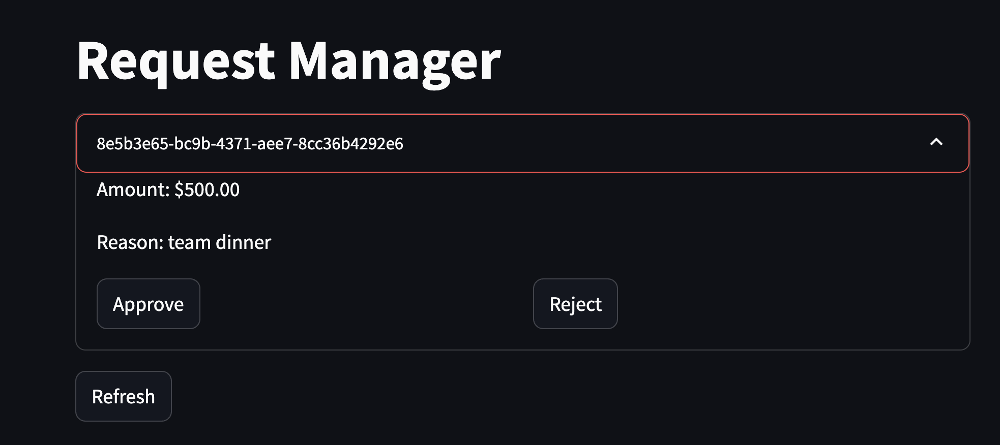
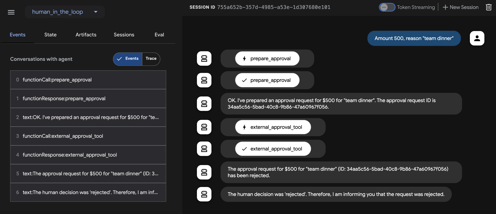

# 🤖🔁👱 ADK Human-in-the-Loop Example

[](https://www.python.org/)
[![Framework](https://img.shields.io/badge/Framework-ADK-4285F4.svg?logo=data:image/png;base64,iVBORw0KGgoAAAANSUhEUgAAAA4AAAAOCAYAAAAfSC3RAAAABGdBTUEAALGPC/xhBQAAACBjSFJNAAB6JgAAgIQAAPoAAACA6AAAdTAAAOpgAAA6mAAAF3CculE8AAAAhGVYSWZNTQAqAAAACAAFARIAAwAAAAEAAQAAARoABQAAAAEAAABKARsABQAAAAEAAABSASgAAwAAAAEAAgAAh2kABAAAAAEAAABaAAAAAAAAAEgAAAABAAAASAAAAAEAA6ABAAMAAAABAAEAAKACAAQAAAABAAAADqADAAQAAAABAAAADgAAAABOylT5AAAACXBIWXMAAAsTAAALEwEAmpwYAAABWWlUWHRYTUw6Y29tLmFkb2JlLnhtcAAAAAAAPHg6eG1wbWV0YSB4bWxuczp4PSJhZG9iZTpuczptZXRhLyIgeDp4bXB0az0iWE1QIENvcmUgNi4wLjAiPgogICA8cmRmOlJERiB4bWxuczpyZGY9Imh0dHA6Ly93d3cudzMub3JnLzE5OTkvMDIvMjItcmRmLXN5bnRheC1ucyMiPgogICAgICA8cmRmOkRlc2NyaXB0aW9uIHJkZjphYm91dD0iIgogICAgICAgICAgICB4bWxuczp0aWZmPSJodHRwOi8vbnMuYWRvYmUuY29tL3RpZmYvMS4wLyI+CiAgICAgICAgIDx0aWZmOk9yaWVudGF0aW9uPjE8L3RpZmY6T3JpZW50YXRpb24+CiAgICAgIDwvcmRmOkRlc2NyaXB0aW9uPgogICA8L3JkZjpSREY+CjwveDp4bXBtZXRhPgoZXuEHAAACRUlEQVQoFXVSS2gTQRj+Z3aziUlF1ISkRqqpVpCaixgkkEOaUGktBopuRQXxKF68pIdCpSsYH4gWxINHT8ZmVUR7MaRND4pUFBFfB7GXqt1iAlGS5rn7O7NpFg/6HeZ/zPfN/PMxAOtQFKSd/L8RFYtDOEmWUVBVovM8fgHDDc+iv+I9VxcgAAhdEtUbP16dTL80uRlZUMdUnXREPBb3/7pDm65g1f3iS9094QRjOwBZWwO09REQ3++kD86qY6DLTAydEWOXy8lYqpzjp/4LB+4fzYVmjiXNPTYyVRRi8IIgRijqk4eua65YqnJLzqDA+wPXijdOALpbzocTaHRFeA+IYliPZaVGCD2cHfdVCJRT6lj7zS1dupoGUhCrsREgVc0Ucm1UQXFBIa3IlVJvU5ceiQTmNyPmddR9DbAZur28Wt1xJi4YjiFq2Eeen7q3FM1HGY2DGQPM1dM3C/5izZ6sGdA9Jzm1YAOc2xzfNj3bNfUJ9t2dhj74DRkQgBlk6vhSy+49b8zBG1wBD69xD4wiQI+Zg/dIHUL97Twq8mi9UaSfo03snSXd8HMlkbitBYbGPxyftHHS99HdW0qDkC4MhOIEFlqoALWEhuGoEVia5UQbLCdoffVdcObSV15v1EpPmfdbkWDbVdazhJQ2KwSlx7gIAfeTtz1EEv3F+MFBLqw7nVNIYNoz//oiG5+Cwj4UIpgGYR58tayQwJzLy8kcODxs53E5HN7AI4fy12WW2Nxhy0e5X+rk7Ia286yBMvtq6/gDb7bjW6TkRnEAAAAASUVORK5CYII=)](https://github.com/google/adk-python)
[](LICENSE)

This is a simple example of using [Agent Development Kit](https://google.github.io/adk-docs/) (ADK) to create a human-in-the-loop workflow.

In this example we will use a human-in-the-loop workflow to send an expense request for manager approval. The agent then waits until the manager approves or rejects the request before proceeding.


## Running the Example

We will use a FastAPI server to handle the expense requests and a Streamlit app to display the pending requests as a manager approval dashboard.

### Start the FastAPI server

The FastAPI server provides basic CRUD operations for the expense requests and stores them in memory in a dictionary.

```bash
uv run server.py
```

The server is now running on `localhost:9000` and provides a REST API for the expense requests.

### Start the Streamlit app

The Streamlit app will display all pending expense requests and allow the manager to approve or reject them.

```bash
uv run streamlit run client.py
```

The Streamlit app is now running on `localhost:8501` and displays a manager approval dashboard.


### Start the ADK agent

```bash
uv run adk web
```

Navigate to `localhost:8000` in your browser to access the ADK web interface.

Go ahead and type something like `Amount 500, reason "team dinner"`.

You should see the agent call the `prepare_approval` tool which creates a new expense request and posts it to the FastAPI server. 

The agent then waits for the manager to approve or reject the request. This is done by calling the `external_approval_tool` tool which polls the FastAPI server for the request status every 30 seconds until the request is no longer `pending` (approved or rejected).

To approve or reject the request, head to the Streamlit app at `localhost:8501` in your browser and click the `Approve` or `Reject` button for the given expense ID.



Hit `Reject` or `Approve` and wait for the agent to poll the FastAPI server for the request status.

Once it does so it should respond accordingly based on the human-in-the-loop decision!


